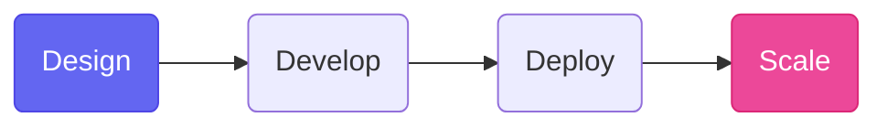

# Welcome to the New Standard

    
PROJECT NEPTUNE v3.0

    
    <h1 class="gradient-text">Documentation Redefined.</h1>
    
A high-performance, glassmorphism-inspired platform for the next generation of developers.

    

        [Start Tutorials](./tutorials.md){ .md-button .md-button--primary }
        [View Features](./admonitions.md){ .md-button }
    

## 🚀 Future-Ready Architecture

The site has been completely rebuilt using the latest 2024 template but enhanced with our signature **Capsule UI**.

- :material-layers-outline:{ .lg .middle } **Glassmorphism UI**

    ---

    Every component now features subtle transparency and blur effects for a deeply modern "layered" feel.

- :material-lightning-bolt-outline:{ .lg .middle } **Instant Loading**

    ---

    Powered by `navigation.instant`, transitions between pages are seamless and blazingly fast.

- :material-palette-swatch-outline:{ .lg .middle } **Dynamic Palettes**

    ---

    A bespoke color system using Indigo and Pink accents, optimized for both Light and Dark slate modes.

---

## 🛠 Enhanced Workflow

